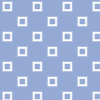
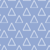
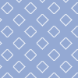
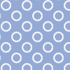
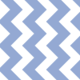
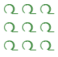

>**[Return to the Masterportal documentation](doc.md)**.

[TOC]

# style.json

The *style.json* file describes visualization rules to control the styling of vector features. It may be used in all sorts of vector layers, namely *WFS*, *GeoJSON*, and *Sensor*.

Style rules may be defined for *3DTileSets*, too.

## What happens on Masterportal start-up

The Masterportal reads the configured *style.json* file and processes it to a list of defined styles in an internal data structure. Layers may request their respective styling instructions from it.

>💡 Hint: Each list entry may be requested via development console by its *styleId* for test purposes. `Backbone.Radio.request("StyleList", "returnModelById", "styleId")`

At the time of layer visualization, the readied [OpenLayers Styles](https://openlayers.org/en/latest/apidoc/module-ol_style_Style-Style.html "OpenLayers Styles") are fetched from the internal data structure and applied to the features.

>💡 Hint: Malformed *style.json* files will be rejected without repair attempt. A warning will be shown. We recommend using an online validator to check your file's syntax, e.g. [jsonlint](https://jsonlint.com/ "jsonlint").

## Style module configuration

The *style.json*'s path is defined in the **[config.js](config.js.md)** file. Follow the link for details. Please mind the following parameters::

- *styleConf*: Defining the file path

>💡 Hint: Incorrect path information is reported with an error message.

## Layer connection

Within the **[config.json](config.json.md)** section *Themenconfig.Layer.Vector* the portal's layers are defined. This includes setting the obligatory *styleId* for vector layers. The *styleId* references a *style.json*'s entry holding the very same *styleId*. See [Structure](#markdown-header-structure).

>💡 Hint: Incorrect style ids do not provoke a run-time error. A warning is logged to the console to inform administrators of the erroneous configuration. Portal users will only notice that the misconfigured layer has the OpenLayers default vector styling.

## Structure

This chapter describes the syntactic and schematic structure as well as the functionality of the *style.json*.

>💡 Hint: The basic JSON file syntax [explained on json.org](https://www.json.org) applies to the *style.json* file.

The *style.json* holds an array of objects at root level. Each object corresponds to a style definition and may be referred to by any vector layer.

**Example 1: Two empty styles**
```json
[
    {},
    {}
]
```

To connect a style of the array to a layer, the attribute *styleId* is required. See chapter [Layer connection](#markdown-header-layerconnection).

**Example 2: Style with id**
```json
{
    "styleId": "1711"
}
```

Next to the *styleId* attribute, a *rules* attribute is required. This is another array and encompasses all the layer's styling rules.

**Example 3: Style with rules**
```json
{
    "styleId": "1711",
    "rules": []
}
```

Each of the *rules* array entries is another object with at least the attribute *style*. This attribute holds the display instructions to be applied if the current rule is met. Please see [Display rules](#markdown-header-displayrules) for details.

**Example 4: Value for a `rules` entry**
```json
[
    {
        "style": {}
    }
]
```

Next to the *style* attribute an optional *conditions* can be added. This is supposed to contain the conditions to be met for the style to be applied to a feature. See chapter [Conditions](#markdown-header-conditions) for details.

**Example 5: Value for a `rules` entry with optional conditions entry**
```json
[
    {
        "conditions": {},
        "style": {}
    }
]
```

**A RULE IS APPLIED TO A FEATURE BY A LOGICAL *OR*, WHERE THE ARRAY IS CHECKED TOP-DOWN (INDEX 0 TO MAX), WHEREAS EACH RULE APPLIES A LOGICAL *AND* OF *PROPERTIES* and *SEQUENCE* (IN CONDITIONS).**

**THE FEATURE WILL HAVE THE FIRST RULE'S STYLE APPLIED WHERE IT FULLY MEETS THE *CONDITIONS*.**

>💡 Hint: If no rule's *conditions* are met, an empty style object is used, effectively rendering the feature invisible.

Unless this is desired behavior, we suggest providing a rule **without** *conditions* as fallback.

**Example 6: Fallback solution**
```json
"rules": [
    {
        "conditions": {},
        "style": {}
    },
    {
        "style": {}
    }
]
```

>💡 Hint: The order of array elements is essential. The style with the first matching *conditions* is used, and all rules following are ignored. Hence, all rules following a default style (any style without *conditions*) are ignored. If the rules in example 6 were swapped, the condition-free rule would always be met and applied, and the rule holding conditions would have been made obsolete.

## Conditions

This section describes the file structure for the *conditions* value as introduced in the chapter [Structure](#markdown-header-structure).

Two optional *condition types* may be used in a condition:

- *properties*
- *sequence*

```json
"conditions": {
    "properties": {},
    "sequence": []
}
```
### *properties*

The attribute *properties* activates a feature property check by comparing the noted values with the actual [feature properties](https://openlayers.org/en/latest/apidoc/module-ol_Feature-Feature.html#getProperties). *properties* are combined with a logical AND, meaning all key-value pairs must hold; in this fashion, all *conditions* are connected.

*properties* are defined as an object, where the key corresponds to a feature attribute's name, and the value to the value expected for it.

```json
"conditions": {
    "properties": {
        "key": "value",
        "key2": "value2"
    }
}
```

*properties* can also be configured as an array of objects.
*properties* as objects are combined with a logical AND, meaning all key-value pairs must hold; in this fashion, all *conditions* are connected.

|Name|Required|Type|Default|Description|Example|
|----|--------|----|-------|-----------|-------|
|attrName|yes|String||Name of attribute.|`"attr1"`|
|value|yes|String/Number/[String]/[Number]||Value or Array of values to be checked||

```json
"conditions": {
    "properties": [
        {
            "attrName": "key",
            "value": [0, 100]
        }
    ]
}
```

### attributeObject
Then it is possible to configure an object instead of an attribute key.

If the *attrName* is given as an object, the following configurations are possible.

|Name|Required|Type|Default|Description|Example|
|----|--------|----|-------|-----------|-------|
|name|yes|String||Name to be shown on an exact match.|`"Test"`|
|condition|yes|enum["contains", "startsWith", "endsWith"]||Condition checked on each feature attribute.|`"startsWith"`|
|type|no|enum["string", "date", "number", "boolean"]|`"string"`|If `"date"`, the portal will attempt to parse the attribute value to a date; If `"Number"`, the portal will attempt to parse the attribute value to with thousand seperator; If “boolean”, the portal will attempt to parse the attribute value to boolean value.|`"date"`|
|format|no|String/Object|`"DD.MM.YYYY HH:mm:ss"/{"key": "value"}`|Data format.|`"DD.MM.YYY"`|
|prefix|no|String||Attribute value prefix.|Add string to value without whitespace `"https://"`|
|suffix|no|String||Attribute value suffix.|`"°C"`|

```json
"conditions": {
    "properties": [
        {
        "attrName": {
            "name": "-fillLevel",
            "condition": "endsWith"
        },
        "value": [0, 100]
        }
    ]
}
```

#### key

The *key* is a feature attribute's name of a direct feature child element.

>💡 Hint: If a key does not exist, the *condition* is not met.

Alternatively an arbitrarily nested property within the feature may be addressed by utilizing an [object path reference](#markdown-header-objectpathreference).

>💡 Hint: Object paths are e.g. used by sensor layers in properties using multiple Datastreams.

A *key* is always of type *String* or an [attributeObject](#markdown-header-attributeobject).

#### value

A *value* is the reference value which is compared to the feature's property with name *key*. *Values* may have these types:

|Type|Description|
|----|-----------|
|Boolean|Direct equality comparison between feature attribute and reference value.|
|String|Direct equality comparison between feature attribute and reference value.|
|Number|Direct equality comparison of the numerical feature attribute and reference value. Should the attribute value be of type *String*, casting it to a numerical value for comparison is attempted.|
|[Number, Number]|An array with two numerical values defines a range interpreted as [minValue, maxValue]. It is checked whether the feature attribute is within that range. Should the attribute value be of type *String*, casting it to a numerical value for comparison is attempted.|
|[Number, Number, Number, Number]|An array with four numerical values defines a relative range [minValue, maxValue, minRelative, maxRelative]. The attribute value is brought in relation to relativeMin and relativeMax, and it is checked whether the result is within the range [minValue, maxValue]. Should the attribute value be of type *String*, casting it to a numerical value for comparison is attempted.|

>💡 Hint: Checking an attribute value `x` against a relative range happens by checking whether `1/(relativMax-relativMin)(x-relativMin)` is in range `[minValue, maxValue]`.

>💡 Hint: `x` is in a range `[minValue, maxValue]` if `minValue <= x < maxValue` is true.

Alternatively a *value* for any of the previously mentioned data types may refer to an arbitrarily nested attribute within a feature property. See chapter [Object path reference](#markdown-header-objectpathreference) for details.

#### Example

This is an exemplary configuration of *properties*. It is assumed features offer matching attributes *name*, *type*, *bedCount*, *staffCount*, *operationCount*, *hamburgOverall.OperationsTargetMin*, and *hamburgOverall.OperationsTargetMax*.

```json
{
    "conditions": {
        "properties": {
            "name": "Children's hospital Wilhelmsstift",
            "type": 1,
            "bedCount": [50, 100],
            "staffCount": [25, 50, 100, 500],
            "operationCount": [0, 50, "@hamburgGesamt.OperationenSollMin", "@hamburgGesamt.OperationenSollMax"]
        }
    }
}
```

### *sequence*

The attribute *sequence* controls an indexical check for *MultiGeometry* features. It is only relevant to these geometry types:

- *MultiPoint*
- *MultiLinestring*
- *MultiPolygon*
- *GeometryCollection*

>💡 Hint: The check is skipped for features with geometry types not listed.

**All *MultiGeometry-Features*  consist of simple *Features*.** Each *Feature* within a *MultiGeometry* feature is iterated over and styled individually. Using *sequence*, an index range of features within the *MultiGeometry* feature can be defined, and only features in this range will be checked for meeting the *condition*.

The range is defined with an array of two numerical values [lowerIndex, upperIndex], so that in the following example the second and third feature are checked in a *MultiGeometry* feature with at least three *Features*.

>💡 Hint: Arrays are zero-based. The first feature of a *Multi-Geometry* is indexed as zeroth entry.

```json
{
    "sequence": [1, 2]
}
```

>💡 Hint: *Sequence* is optional for *MultiGeometry* features.

### Object path reference

Object path references may be set for both *keys* and *values* in the *properties*.

**Any string prefixed `@` is interpreted as object path reference.**

Using such a reference is e.g. useful when attributes contain nested values that need to be referred to.

>💡 Hint: Object paths are especially used in sensor layers as they partially work on multiple Datastreams that need to be differentiated.

For example, an object path `"@Datastreams.0.ObservedProperty.name"` returns `"myName"` from the following structure:

```js
{
    "featureProperties": {
        "name": "Children's hospital Wilhelmsstift",
        "Datastreams": [
            {
                "ObservedProperty": {
                    "name": "myName"
                }
            }
        ]
    }
}
```

>💡 Hint: Object paths may contain both objects and arrays. The entry `Datastrams.0` describes following an arrays first entry.

>💡 Hint: Arrays are zero-based. An array's first entry is adressed with `Datastreams.0`, its second with `Datastreams.1`, and so on.

You may also use object path references for direct child elements. For example, features with direct child properties may be structured like this:

```js
{
    "featureProperties": {
        "name": "Children's hospital Wilhelmsstift",
        "alternativeName": "Wartestube"
    }
}
```

You can check whether the fields `"name"` and `"alternativeName"` are identical with this *condition*:

```js
{
    "conditions": {
        "properties": {
            "name": "@alternativeName"
        }
    }
}
```

## Display rules

This chapter describes how a *style* as introduced in the [Structure](#markdown-header-structure) chapter is constructed.

Styling depends on the *GeometryType* of a *Feature*. All *MultiGeometry* features  consist of simpler *Features*. Within a *MultiGeomtry* feature all child *Features* are iterated and each one is styled individually. The following *GeometryTypes* can currently be styled:


- [Linestring](#markdown-header-linestring)
- [Point](#markdown-header-point)
- [Polygon](#markdown-header-polygon)
- [Cesium](#markdown-header-cesium)

>💡 Hint: *MultiGeometries* defined within a *GeometryCollection* (doubly nested) can currently not be styled.

The *GeometryType* is determined by calling the *DescribeFeatureTypes* service of a WFS layer. In some cases, the type *"Geometry"* is returned, which leads to the creation of styles for LineString, Point, and Polygon. You may override this behaviour on the [config.json's styleGeometryType parameter](config.json.md#markdown-header-themenconfiglayervector) of each layer.

Styling is based on the feature's *GeometryType*. For each type, default display rules are applied that may be overwritten by *style* entries.

**_style_ example:**
```json
{
    "style": {
        "imageName": "hospital.png",
        "clusterImageName": "hospital.png"
    }
}
```

>This allows styling multiple *GeometryTypes* (Point, Linestring, Polygon, ...) within a *style* by adding display rules.

Furthermore, all named geometry types may receive a text annotation. See chapter [Text](#markdown-header-text) for details.

For individual legend texts, see chapter [Legend](#markdown-header-legend).

### Use Fallback, if no rule available

If the number of child *Features*  of a *MultiGeomtry* feature is higher than the number of rules or no rule can be found, and no fallbacks shall be used you can set the property *styleMultiGeomOnlyWithRule* to true.

|Name|Required|Type|Default|Description|
|----|--------|----|-------|-----------|
|styleMultiGeomOnlyWithRule||Boolean|false| if true, use no fallback for styling

**_style_ example:**
```json
{
    "styleId": "styleId",
    "styleMultiGeomOnlyWithRule": true,
}
```


### Point

The display rules for points are separated in

- simple point geometries: See the following parameter *type*.
- clustered points: If the layer configuration in the (**[config.json](config.json.md)**) file has *clusterDistance* set, a ClusterStyle is created. See the following parameter *clusterType*.

|Name|Required|Type|Default|Description|
|----|--------|----|-------|-----------|
|type||String|`"circle"`|Type of styling; one of [icon](#markdown-header-pointicon), [circle](#markdown-header-pointcircle), [nominal](#markdown-header-pointnominal), [interval](#markdown-header-pointinterval).|
|clusterType||String|`"circle"`|Type of styling for clustered points; one of [icon](#markdown-header-pointclustericon), [circle](#markdown-header-pointclustercircle).|

In the following, all options are described in detail.

#### Point.Icon

Please see the [OpenLayers Icon documentation](https://openlayers.org/en/latest/apidoc/module-ol_style_Icon-Icon.html "OpenLayers Icon documentation") for additional details.

|Name|Required|Type|Default|Description|
|----|--------|----|-------|-----------|
|imageName||String|`"blank.png"`|Image name|
|imageWidth||String|`1`|Image width|
|imageHeight||String|`1`|Image height|
|imageScale||String|`1`|Image scale|
|imageOffsetX||Float|`0.5`|Image x Offset|
|imageOffsetY||Float|`0.5`|Image y offset|
|imageOffsetXUnit||String|`"fraction"`|Units in which the anchor x value is specified.|
|imageOffsetYUnit||String|`"fraction"`|Units in which the anchor y value is specified.|
|rotation|no|**[rotation](#markdown-header-pointiconrotation)**|`0`|Attribute for rotation of wfs features. If not set, the default value is `0` to show icons in standard alignment.|

#### Point.Icon.rotation

If set, the entry `rotation` has to be from type object with the following attributes:

|Name|Required|Type|Default|Description|
|----|--------|----|-------|-----------|
|rotation.isDegree||Boolean|`false`|Whether value should be treated as degrees or radiants.|
|rotation.value||Number|`0`|Rotation value (positive rotation clockwise).|

#### Point.Circle

Please see the [OpenLayers Circle documentation](https://openlayers.org/en/latest/apidoc/module-ol_geom_Circle-Circle.html "OpenLayers Circle documentation") for additional details.

|Name|Required|Type|Default|Description|
|----|--------|----|-------|-----------|
|circleRadius||Integer|`10`|Circle radius|
|circleStrokeColor||Integer[]|`[0, 0, 0, 1]`|Circle stroke color as rgba|
|circleStrokeWidth||Integer|`2`|Circle stroke width in pixels|
|circleFillColor||Integer[]|`[0, 153, 255, 1]`|Circle fill color as rgba|

#### Point.Interval

A dynamic style is set for each feature. This style supports sensor feature updates for numerical data having a natural order, e.g. meters and degree Celsius.

|Name|Required|Type|Default|Description|
|----|--------|----|-------|-----------|
|scalingShape|yes|String||Display type `"CIRCLE_BAR"`|
|scalingAttribute|yes|String||Attribute used for styling|
|circleBarScalingFactor||Float|`1`|Factor by which the attribute value is scaled. Required for very large positive or negative values and values nearby zero.|
|circleBarRadius||Float|`6`|Point radius|
|circleBarLineStroke||Float|`5`|Bar width|
|circleBarCircleFillColor||Integer[]|`[0, 0, 0, 1]`|Point color fill in rgba|
|circleBarCircleStrokeColor||Integer[]|`[0, 0, 0, 1]`|Point stroke color in rgba|
|circleBarCircleStrokeWidth|||`1`|Point stroke width in pixels|
|circleBarLineStrokeColor||Integer[]|`[0, 0, 0, 1]`|Bar color in rgba|

#### Point.Nominal

A dynamic style is set for each feature. This style supports sensor feature updates for data without natural order, e.g. colors and shapes.

|Name|Required|Type|Default|Description|
|----|--------|----|-------|-----------|
|scalingShape|yes|String||Display type `"CIRCLESEGMENTS"`|
|scalingAttribute|yes|String||Attribute used for styling. You may use an [object path reference](#markdown-header-objectpathreference).|
|scalingValues||Object||Attribute values with defined color, e.g. `{"charging" : [220, 0, 0, 1]}`. An arbitrary amount of attribute values may be specified.|
|scalingValueDefaultColor||Integer[]|`[0, 0, 0, 1]`|Default color for all values not defined in the previously described *scalingValues* field.|
|circleSegmentsRadius||Float|`10`|Circle segment radius|
|circleSegmentsStrokeWidth||Float|`4`|Circle segment width|
|circleSegmentsGap||Float|`10`|Space between circle segments|
|circleSegmentsBackgroundColor||Integer[]|`[255, 255, 255, 0]`|Circle color|

#### Point.Cluster

Clustered points represent multiple close-by features with a single symbol. See the [OpenLayers Cluster documentation](https://openlayers.org/en/latest/apidoc/module-ol_source_Cluster-Cluster.html "OpenLayers Cluster documentation") for further details. Display depends upon amount and position of features, current zoom level, and the layer's defined *clusterDistance*. *PointClusters* may be displayed with these types:

- [Icon](#markdown-header-pointclustericon")
- [Circle](#markdown-header-pointclustercircle)

You may also add text to clustered points. This is usually done to add the amount of clustered points to a feature. See chapter [ClusterText](#markdown-header-pointclustertext).

#### Point.Cluster.Icon

Please see the [OpenLayers Icon documentation](https://openlayers.org/en/latest/apidoc/module-ol_style_Icon-Icon.html "OpenLayers Icon documentation") for additional details.

|Name|Required|Type|Default|Description|
|----|--------|----|-------|-----------|
|clusterImageName||String|`"blank.png"`|Cluster style image name|
|clusterImageWidth||Integer|`1`|Cluster style image width|
|clusterImageHeight||Integer|`1`|Cluster style image height|
|clusterImageScale||Integer|`1`|Cluster style image scale|
|clusterImageOffsetX||Float|`0.5`|Cluster style X offset|
|clusterImageOffsetY||Float|`0.5`|Cluster style Y offset|

#### Point.Cluster.Circle

Please see the [OpenLayers Circle documentation](https://openlayers.org/en/latest/apidoc/module-ol_geom_Circle-Circle.html "OpenLayers Circle documentation") for additional details.

|Name|Required|Type|Default|Description|
|----|--------|----|-------|-----------|
|clusterCircleRadius||Integer|`10`|Cluster style circle radius|
|clusterCircleFillColor||Integer[]|`[0, 153, 255, 1]`|Cluster style circle fill in rgba|
|clusterCircleStrokeColor||Integer[]|`[0, 0, 0, 1]`|Cluster style stroke color in rgba|
|clusterCircleStrokeWidth||Integer|`2`|Cluster style stroke width in pixels|

#### Point.Cluster.Text

Please see the [OpenLayers Text documentation](https://openlayers.org/en/latest/apidoc/module-ol_style_Text-Text.html "OpenLayers Text documentation") for additional details.

Two types of cluster types may be shown, depending on the attribute *clusterTextType*:

- *counter*: amount of clustered features
- *text*: a fixed text
- *none*: no text at all

|Name|Required|Type|Default|Description|
|----|--------|----|-------|-----------|
|clusterTextType||String|`"counter"`|One of `"counter"`, `"none"`, `"text"`|
|clusterText|only if *clusterTextType* is set to `"text"`|String|`"undefined"`|Text to be displayed|
|clusterTextAlign||String|`"center"`|Text alignment|
|clusterTextFont||String|`"Comic Sans MS"`|Text font|
|clusterTextScale||Integer|`2`|Text scale|
|clusterTextOffsetX||Integer|`0`|Text x offset|
|clusterTextOffsetY||Integer|`2`|Text y offset|
|clusterTextFillColor||Integer[]|`[255, 255, 255, 1]`|Text fill color in rgba|
|clusterTextStrokeColor||Integer[]|`[0, 0, 0, 0]`|Text stroke color in rgba|
|clusterTextStrokeWidth||Integer|`0`|Text stroke width|

>💡 Hint: A cluster text is prioritized to a general text.

### LineString

Please see the [OpenLayers Stroke documentation](https://openlayers.org/en/latest/apidoc/module-ol_style_Stroke-Stroke.html "OpenLayers Stroke documentation") for additional details.

|Name|Required|Type|Default|Description|
|----|--------|----|-------|-----------|
|lineStrokeColor||Integer[]|`[255, 0, 0, 1]`|Line color in rgba|
|lineStrokeWidth||Integer|`5`|Line width|
|lineStrokeCap||String|`"round"`|Line cap style|
|lineStrokeJoin||String |"round"`|Line join style|
|lineStrokeDash||Integer[]|`null`|Line dash style|
|lineStrokeDashOffset||Integer|`0`|Line dash offset|
|lineStrokeMiterLimit||Integer|`10`|Miter limit|

### Polygon

Please see the [OpenLayers Fill]([-](https://openlayers.org/en/latest/apidoc/module-ol_style_Fill-Fill.html) "OpenLayers Fill documentation") and [OpenLayers Stroke](https://openlayers.org/en/latest/apidoc/module-ol_style_Stroke-Stroke.html "OpenLayers Stroke documentation") documentation for additional details.

|Name|Required|Type|Default|Description|
|----|--------|----|-------|-----------|
|polygonStrokeColor||Integer[]|`[0, 0, 0, 1]`|Line color in rgba|
|polygonStrokeWidth||Integer|`1`|Line width|
|polygonStrokeCap||String|`"round"`|Line cap style|
|polygonStrokeJoin||String|`"round"`|Line join style|
|polygonStrokeDash||Integer[]|`null`|Line dash style|
|polygonStrokeDashOffset||Integer|`0`|Line dash offset|
|polygonStrokeMiterLimit||Integer|`10`|`Miter limit`|
|polygonFillColor|no|Integer[]|`[10, 200, 100, 0.5]`|Fill color in rgba|
|polygonFillHatch|no|**[polygonFillHatch](#markdown-header-polygonpolygonfillhatch)**[]|`undefined`|Can be used to define a hatch pattern. Mutually exclusive to polygonFillColor – only one of the fields may be used. If both are defined, `polygonFillHatch` takes precedence.|

#### Polygon.polygonFillHatch

The polygonFillHatch allows drawing various patterns to distinguish polygons by style configuration. Use these patterns to enhance accessibility. [This article](http://betweentwobrackets.com/data-graphics-and-colour-vision/#patternstotherescue) about cake diagrams also applies to polygons.

> ⚠️ *Please mind that hatch patterns for vector layers are not supported by the [MapFish JSON parser](https://mapfish.github.io/mapfish-print-doc/styles.html#mapfishJsonParser), and hence can't be printed.*

|Name|Required|Type|Default|Description|
|----|--------|----|-------|-----------|
|pattern|no|enum["diagonal", "diagonal-right", "zig-line", "zig-line-horizontal", "circle", "rectangle", "triangle", "diamond"]/Object|`"diagonal"`|Draw pattern. You may either use a pre-defined pattern from the enum or specify one yourself. For both, examples are given below.|
|size|no|Number|`30`|Edge length of a singular repeated pattern element.|
|lineWidth|no|Number|`10`|Line width of drawn pattern. To achieve an even distribution in diagonal and zig-line pattern, choose lineWidth as (1/3 * size). For triangle and diamond, a lineWidth of 1 must be chosen. For rectangle, a lineWidth of at most (1/4 * size) should be chosen. Deviating from these rules is not harmful, but patterns may seem off.|
|backgroundColor|no|Number[]|`[0, 0, 0, 1]`|Background color of polygon.|
|patternColor|no|Number[]|`[255, 255, 255, 1]`|Fill color of pattern drawn on polygon.|

```json
{
    "polygonStrokeColor": [0, 0, 0, 1],
    "polygonStrokeWidth": 2,
    "polygonFillHatch": {
        "pattern": "diagonal",
        "lineWidth": 10,
        "size": 30,
        "backgroundColor": [100, 100, 255, 0.5],
        "patternColor": [255, 255, 255, 1]
    }
}
```

With the example style above, the following patterns are rendered, where `pattern` and `lineWidth` are adjusted as follows:

|`polygonFillHatch` override|Result|
|-|-|
|`{"patternCode": "rectangle", "lineWidth": 2}`||
|`{"patternCode": "triangle", "lineWidth": 1}`||
|`{"patternCode": "diamond", "lineWidth": 1}`||
|`{"patternCode": "circle", "lineWidth": 2}`||
|`{"patternCode": "circle", "lineWidth": 10}`||
|`{"patternCode": "diagonal", "lineWidth": 10}`||
|`{"patternCode": "zig-line", "lineWidth": 10}`||

The alternatives `"zig-lines-horizontal"` and `"diagonal-right"` match the above patterns rotated by 90°.

>🛠️ Expert feature: Defining your own pattern.

Should the givens pattern not suffice, you may use an object defining the hatch rules. For example, the following object will draw a triangle and rotate it around its center by 90 degrees. The given parameters are relative to size. In this example, the starting point is "half way to the right, one third from the top". You may also use numbers above 1 and below 0 to draw over the borders. This will be cut, but may come in handy for using rotation.

```json
{
    "draw": [
        {
            "type": "line",
            "parameters": [
                [0.5, 0.33],
                [0.66, 0.66],
                [0.33, 0.66],
                [0.5, 0.33]
            ]
        }
    ],
    "rotate": 90
}
```

To draw circles or circle parts, this syntax can be used:

```json
{
    "draw": [
        {
            "type": "arc",
            "parameters": [
                0.75, 0.75, 2.5, 0, 6.283185307179586
            ]
        }
    ]
}
```

The parameters match the [arc](https://developer.mozilla.org/en-US/docs/Web/API/CanvasRenderingContext2D/arc) function parameters.

With these, the following example pattern resembling a commonly used deciduous tree symbol can be produced:



It is drawn with three elements: A 2/3 circle describing the general shape, and a 1/3 circle to the right and a short line at the ground level to indicate shadow.

```json
{
    "pattern": {
        "draw": [
            {
                "type": "arc",
                "parameters": [
                    0.5, 0.5, 7.5, -4.14, 1.14
                ]
            },
            {
                "type": "arc",
                "parameters": [
                    0.55, 0.5, 7.5, -2, 1.14
                ]
            },
            {
                "type": "line",
                "parameters": [
                    [0.66, 0.75],
                    [1, 0.75]
                ]
            }
        ]
    },
    "lineWidth": 1,
    "size": 30,
    "backgroundColor": [255, 255, 255, 1],
    "patternColor": [0, 100, 0, 1]
}
```

You may also use [rect](https://developer.mozilla.org/en-US/docs/Web/API/CanvasRenderingContext2D/rect) for convenience. In that case, "parameters" is an array of call argument arrays, matching the `rect` function definition. The following is the default implementation for the "rectangle" pattern.

```json
{"type": "rect", "parameters": [
    [0.125, 0.125, 0.25, 0.25],
    [0.625, 0.625, 0.25, 0.25]
]}
```

### Cesium

|Name|Required|Type|Default|Description|
|----|--------|----|-------|-----------|
|color||String||Color as rgb(a) string|

#### 3DTileSets example

```json
{
    "styleId": "3DTileSetStyle",
    "rules": [
        {
            "conditions": {
                "attr3": [15, 17],
                "attr4": "abc"
            },
            "style": {
                "type": "cesium",
                "color": "rgba(0, 0, 255, 0.5)"
            }
        },
        {
            "conditions": {
                "attr2": [0, 10]
            },
            "style": {
                "type": "cesium",
                "color": "rgba(0, 255, 0, 0.5)"
            }
        },
        {
            "conditions": {
                "attr1": 50.5
            },
            "style": {
                "type": "cesium",
                "color": "rgb(255, 0, 0)"
            }
        },
        {
            "style": {
                "type": "cesium",
                "color": "rgba(150, 150, 150, 0.5)"
            }
        }
    ]
}
```

### Text

Please see the [OpenLayers Text documentation](https://openlayers.org/en/latest/apidoc/module-ol_style_Text-Text.html "OpenLayers Text documentation") for additional details.

Use the attribute *labelField* within the *style* to choose one of the *FeatureProperties* to be printed and styled to the feature.
.
>💡 Hint: Is no attribute *labelField* is set, no label will be created.

|Name|Required|Type|Default|Description|
|----|--------|----|-------|-----------|
|labelField|yes|String|`"undefined"`|Feature attribute to be used as label. You may also use an [object path reference](#markdown-header-objectpathreference) or an [attributeObject](#markdown-header-attributeobject).|
|textAlign||String|`"center"`|Text alignment|
|textFont||String|`"Comic Sans MS"`|Text font|
|textScale||Integer|`2`|Text scale|
|textOffsetX||Integer|`10`|Text x offset|
|textOffsetY||Integer|`-8`|Text y offset|
|textFillColor||Integer[]|`[69, 96, 166, 1]|Text fill color in rgba|
|textStrokeColor||Integer[]|`[240, 240, 240, 1]`|Text stroke color in rgba|
|textStrokeWidth||Integer|`3`|Text stroke width in pixels|
|textSuffix|no|String|`""`|Text suffix added to each text|

>💡 Hint: A cluster text is prioritized to this.

### Legend

The textual legend description can be controlled by setting the parameter *legendValue* accordingly.

```json
{
    "style": {
        "legendValue": "my legend text"
    }
}
```
>💡 Hint: The attribute *legendValue* must be unique per layer and geometry type; else, the legend will be incomplete.

## Example

A SensorLayer example configuration.

```json
[
    {
        "styleId": "1711",
        "rules": [
            {
                "conditions": {
                    "properties": {
                        "@Datastreams.1.Observations.0.result": [1, 3]
                    }
                },
                "style": {
                    "type": "circle",
                    "circleFillColor": [255, 0, 0, 1],
                    "clusterType": "circle"
                }
            },
            {
                "conditions": {
                    "properties": {
                        "@Datastreams.1.Observations.0.result": [3, 8]
                    }
                },
                "style": {
                    "type": "circle",
                    "circleFillColor": [255, 255, 102, 1],
                    "clusterType": "circle"
                }
            },
            {
                "conditions": {
                    "properties": {
                        "@Datastreams.1.Observations.0.result": [8, 50]
                    }
                },
                "style": {
                    "type": "circle",
                    "circleFillColor": [132, 222, 2, 1],
                    "clusterType": "circle"
                }
            },
            {
                "conditions": {
                    "properties": {
                        "@Datastreams.1.Observations.0.result": "no data"
                    }
                },
                "style": {
                    "type": "circle",
                    "circleFillColor": [200, 200, 1, 1],
                    "clusterType": "circle"
                }
            },
            {
                "conditions": {
                    "properties":{
                        "@Datastreams.0.Observations.0.result":true
                    }
                },
                "style": {
                    "lineStrokeColor": [44,127,184, 0.7]
                }
            },
            {
                "style": {
                    "type": "circle",
                    "circleFillColor": [211, 211, 211, 1],
                    "clusterType": "circle"
                }
            }
        ]
    }
]
```
### HighlightFeaturesByAttribute

The styling of the polygon, line and point features can be overwritten by defining styles for "defaultHighlightFeaturesPolygon", "defaultHighlightFeaturesLine" and "defaultHighlightFeaturesPoint".
## Example

A highlightFeaturesByAttribute example configuration for all types of features (polygon, line and point).

```json
[
  {
    "styleId": "defaultHighlightFeaturesPoint",
    "rules": [{
        "style": {
            "type": "circle",
            "circleFillColor": [255, 255, 0, 0.9],
            "circleRadius": 8,
            "circleStrokeColor": [0, 0, 0, 1],
            "circleStrokeWidth": 2
        }
    }]
  },
  {
    "styleId": "defaultHighlightFeaturesLine",
    "rules": [{
        "style": {
            "lineStrokeColor": [255, 0, 0, 1],
            "lineStrokeWidth": 5
        }
    }]
  },
  {
    "styleId": "defaultHighlightFeaturesPolygon",
    "rules": [{
        "style": {
            "polygonStrokeColor": [8, 119, 95, 1],
            "polygonStrokeWidth": 4,
            "polygonFillColor": [8, 119, 95, 0.3],
            "polygonStrokeDash": [8]
        }
    }]
  }
]
```
