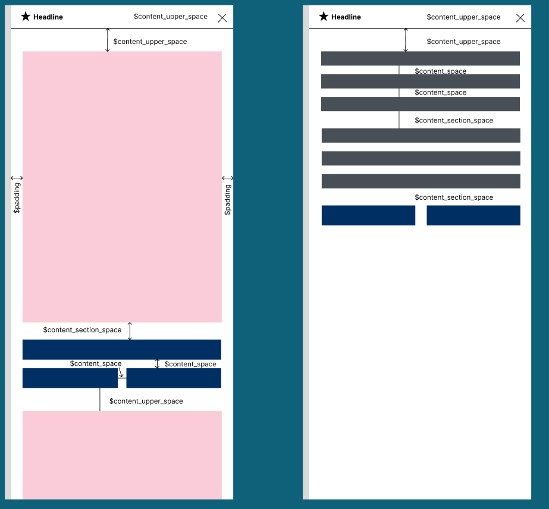

>**[Return to the Masterportal documentation](doc.md)**.

# Variables Documentation

This documentation describes how the variables in Masterportal are intended to be used.


## Structure of this documentation

[TOC]


## Colors

For Masterportal we use a few different colors.

Most importantly:
```
$light_grey: #E3E3E3;
$dark_blue: #003063;
$white: #ffffff;
$black: #000;
$light_red: #E10019;
$dark_grey: #424242;
$light_blue: #00437A;
```

These colors are Hamburg specific colors and can be overwritten.

### Primary variable
Furthermore we overwrite bootstrap's `$primary` variable with the `$dark_blue` variable which means all bootstrap uses of the primary variable are now in this dark blue. For example the class btn-primary or bg-primary.
The primary button in a tool should have the class btn-primary.
Primary buttons should always be used if there is only one button.

### Secondary variable
We also overwrite the secondary variable. Secondary buttons should be used as the less important buttons in a tool etc.
For example cancel or back buttons that are less important. Secondary buttons should always be used if there is more than one button.

### Table styles
Additionally, there are certain table styles set as well as contrasting colors for the light_grey variable.

### Notification colours
Notification colours can be used directly from Bootstrap.
Keywords: success, info, warning, danger. For example btn-info.
We still use the variable `$light_red` in certain places for red warnings. The color does not have a high enough contrast and should therefor be used sparingly.
Therefore the bootstrap danger variable is overwritten by light_red.

### Usage
Generally it is best practice to use bootstrap classes and variables in the html code already such as btn-primary or bg-primary. If this is too much though, it is better to use variables in the scss code.

## Sizing

For sizes we also have different variables that you can use:
Usually the base size for rem is 16px (Browser Default) which is 1rem in the code. This can be changed by setting font-size in the html tag. Masterportal is also based on 16px for rem calculations but the base font size is 12 px (0.75rem based on 16px).
This means: when you use 1rem in scss Code, it will be 16px but if you use the font variables, 1rem is 12px.

### Font Size / Typography
Bootstrap offers these:
$font-size-base:              1rem;
$font-size-sm:                $font-size-base * .875;
$font-size-lg:                $font-size-base * 1.25;

We set our base Size to 12px which you can see in App.vue where we use `$font_size_default` that is set to 12px in variables.scss.
If you want a bigger default size, change the `$font_size_default` and everywhere where the bootstrap classes (-base, -sm, -lg) is used the font will be scaled accordingly.
You can overwrite these variables if need be.

### Tools
Tools should be rendered to the sidebar. You can enable this by setting "renderToWindow": false.
Tools should have the `$content_upper_space` at the top between content and the top line.
Between two different content sections `$content_section_space` and between content within a section (for example between an input field and the next input field) itself `$content_space`.
Theses variables also depend on the default base size 16px. If you change the font size in the html tag, the spaces will also be bigger/smaller, because this changes the base size.

In this image you can see how the variables are meant to be used in tools:


